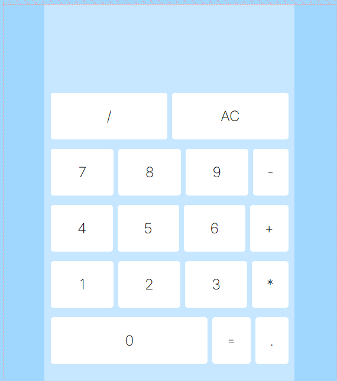

# Odin-Project Calculator

## About

It's a project made for the odin-project challenge, it uses flex-box for it's design and functionalities like basic operations, decimal dot and a error handler (in case you divide by 0).

## Visual

;

**View at https://peppegiu.github.io/Odin-project-calculator/**
